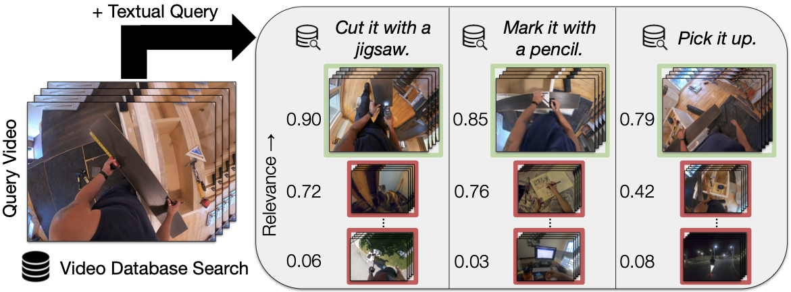
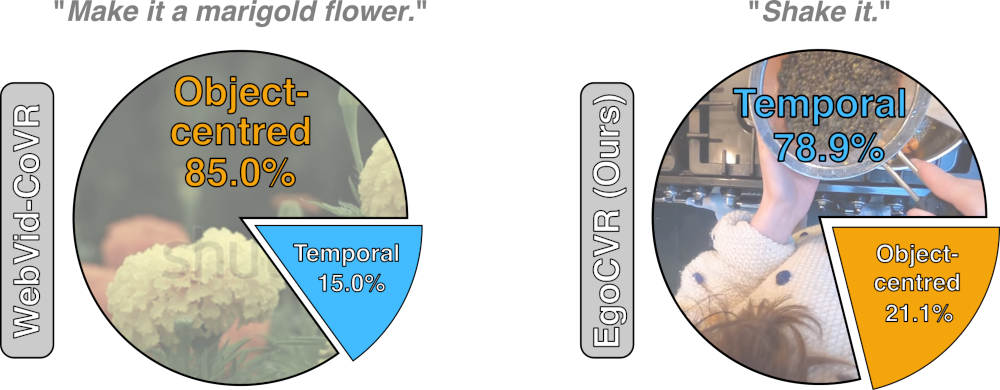

# EgoCVR: An Egocentric Benchmark for Fine-Grained Composed Video Retrieval [ECCV 2024] 

__Authors__: Thomas Hummel*, Shyamgopal Karthik*, Mariana-Iuliana Georgescu, Zeynep Akata

[](TBA)


### Abstract
<div align="justify">

> In Composed Video Retrieval, a video and a textual description which modifies the video content are provided as inputs to the model. The aim is to retrieve the relevant video with the modified content from a database of videos. 
In this challenging task, the first step is to acquire large-scale training datasets and collect high-quality benchmarks for evaluation. In this work, we introduce EgoCVR, a new evaluation benchmark for fine-grained Composed Video Retrieval using large-scale egocentric video datasets. EgoCVR consists of 2,295 queries that specifically focus on high-quality temporal video understanding. We find that existing Composed Video Retrieval frameworks may not achieve the necessary high-quality temporal video understanding for this task.
To address this shortcoming, we adapt a simple training-free method, propose a generic re-ranking framework for Composed Video Retrieval, and demonstrate that this achieves strong results on EgoCVR.
</div>




## The EgoCVR benchmark
We propose EgoCVR, a benchmark with 2,295 queries, to evaluate vision-language models for the task of Composed Video Retrieval. The videos and corresponding annotations were collected from the [Ego4D FHO task](https://ego4d-data.org/docs/tutorials/FHO_Overview/).


### Comparison to existing benchmarks

EgoCVR focuses to a significantly greater extent on temporal and action-related modifications (blue) as opposed to object-centred modifications (orange) when compared to the previously existing WebVid-CoVR-Test benchmark.

## Dataset structure

### Annotations
The annotations for the EgoCVR benchmark are stored in ```annotation/egocvr/egocvr_annotations.csv```. Each row in the CSV file corresponds to a single query. The columns are as follows:

- ```video_clip_id```: The unique identifier of the query video clip.
- ```target_clip_ids```: The unique identifiers of the target video clips.
- ```video_clip_narration```: The narration of the query video clip.
- ```target_clip_narration```: The narration of the target video clips.
- ```instruction```: The textual video modification instruction for the query.
- ```modified_captions```: Our TF-CVR modified captions for retrieving the target video clips (see Paper).

### Evaluation
We consider two possible evaluation settings for EgoCVR:
- ```global```:  The standard composed image/video retrieval setting, where the gallery comprises a long list of videos. In the global setting, the query is searched in the pool of videos, which contains all the other video queries, along with their video distractors.
- ```local```: The local search is obtained by restricting the gallery to have only clips from the same video sequence. This strategy simulates the scenario when searching in a long video for a specific moment.

The gallery information for the EgoCVR benchmark is stored in ```annotation/egocvr/egocvr_annotations_gallery.csv```. In addition to the columns from the query annotations, the gallery annotations contain the following columns:
- ```global_idx```: Indices of videos of the gallery for the global evaluation. 
- ```local_idx```: Indices of videos of the gallery for the local evaluation.

Please follow the instructions below for downloading the gallery information.

## Setup
1. Install the required packages
2. Download the EgoCVR gallery information
3. Download either the EgoCVR videos or the pre-computed model embeddings
4. Download the model weights

### 1. Installing Required Packages
> Instructions coming soon.

### 2. Downloading the EgoCVR Gallery Information
The gallery information for the EgoCVR benchmark is stored in ```annotation/egocvr/egocvr_annotations_gallery.csv```. The gallery information can be downloaded from the following link:
- EgoCVR Gallery Information: [Download](https://drive.google.com/file/d/1JInKIJP22VgXjO1uNWUrV9SK6I2-43QA/view?usp=share_link)


### 3. Downloading the EgoCVR Videos or Pre-computed Model Embeddings

#### EgoCVR Videos

We provide the video clips from the EgoCVR benchmark to download. We provide the clips in original full scale and downscaled to with the short side 256px. For all models we use the full scale video clips as input except for EgoVLPv2, for which we follow the model recommendations of downscaling first ([more information](https://github.com/facebookresearch/EgoVLPv2/blob/main/EgoVLPv2/README.md)).

- Full scale video clips: [Download](https://drive.google.com/file/d/15izxkJHGGeue9nFPxJjuIbKZoYH2MqMA/view?usp=share_link) 
- Downscaled video clips: [Download](https://drive.google.com/file/d/15-v6nBVYJ5LA1HpHXvzdQS72awqkFM7L/view?usp=share_link)

After downloading, please extract the zip file and place the video clips to the ```data/``` directory.
```bash
unzip egocvr_clips.zip -d data/
unzip egocvr_clips_256.zip -d data/
```

#### Pre-computed Model Embeddings
We provide also the pre-computed model embeddings for the EgoCVR benchmark to download.
- EgoVLPv2 Embeddings: [Download](TBA)
- LanguageBind Embeddings: [Download](TBA)
- BLIP Embeddings: [Download](TBA)
- CLIP Embeddings: [Download](TBA)

After downloading, please extract the zip file and place the model embeddings to the ```embeddings/``` directory.
```bash
unzip egocvr_embeddings_egovlpv2.zip -d embeddings/
```

### 4. Downloading the Model Weights

- EgoVLPv2 Model Weights: [Download](http://www.cis.jhu.edu/~shraman/EgoVLPv2/ckpts/Pre-trained/EgoVLPv2.pth) (from the [official repository](https://github.com/facebookresearch/EgoVLPv2/blob/main/EgoVLPv2/README.md))
- BLIP<sub>CoVR</sub> Model Weights: [Download](https://huggingface.co/lucas-ventura/CoVR/resolve/main/webvid-covr.ckpt) (from the [official repository](https://github.com/lucas-ventura/CoVR/))

The model weights should be placed in the ```checkpoints/``` directory.


## Evaluation
To evaluate different methods on the EgoCVR benchmark, please run the following command:
```bash
# Evaluation in the global setting
python egocvr_retrieval.py --evaluation global
# Evaluation in the local setting
python egocvr_retrieval.py --evaluation local
```
You can specify the model and the modalities to evaluate by using the following arguments:
- ```--model```: The model to evaluate. Possible values are ```egovlpv2```, ```languagebind```, ```blip```, and ```clip```.
    - For 2-Stage retrieval, you can use up to two models separated by a space. For example, ```--model languagebind egovlpv2```.
- ```--modalities```: The query modalities to use. Possible values are ```visual```, ```text```, and ```visual-text```.
    - For 2-Stage retrieval, you can use up to two modalities separated by a space. For example, ```--modalities visual text```.
- ```--text```: The source of the query text to use. Possible values are 
    - ```instruction```: The original instruction from the query annotation.
    - ```tfcvr```: The TF-CVR modified captions from the query annotation. These captions are created by video captioning the query video and then modifying the captions according to the instruction using an LLM (see Paper).
    - ```gt```: The ground truth narration from the target video clip.

### TFR-CVR: Training-Free Re-ranking for Composed Video Retrieval
In the Paper, we propose a simple training-free re-ranking method for Composed Video Retrieval. To evaluate the TFR-CVR and TF-CVR method, please run the following command:
```bash
# 2-Stage retrieval in the global setting
python egocvr_retrieval.py --evaluation global --model languagebind egovlpv2 --modalities visual text --text tfcvr

# 1-Stage TF-CVR in the local setting
python egocvr_retrieval.py --evaluation local --model egovlpv2 --modalities text --text tfcvr
```

### Additional Examples
```bash
# CLIP
python egocvr_retrieval.py --evaluation global --model clip --modalities visual-text --text instruction
# BLIP
python egocvr_retrieval.py --evaluation global --model blip --modalities visual-text --text instruction
# LanguageBind
python egocvr_retrieval.py --evaluation global --model languagebind --modalities visual-text --text instruction
# BLIP_CoVR
python egocvr_retrieval.py --evaluation global --model blip --modalities visual-text --text instruction --fusion crossattn --finetuned
```


### Citation
```bibtex
@article{hummel2024egocvr,
  title={EgoCVR: An Egocentric Benchmark for Fine-Grained Composed Video Retrieval},
  author={Thomas Hummel and Shyamgopal Karthik and Mariana-Iuliana Georgescu and Zeynep Akata},
  journal={European Conference on Computer Vision (ECCV)},
  year={2024}
}
```
